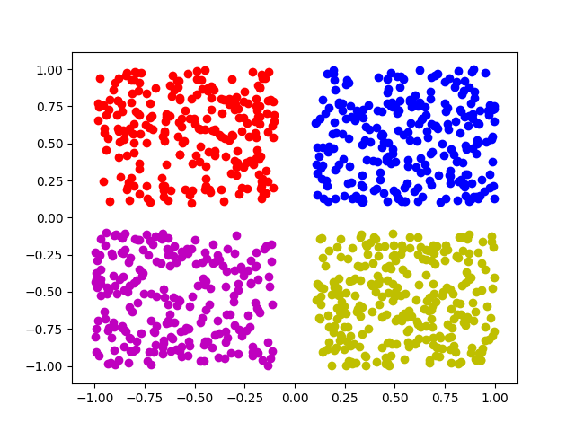

#README.md
 
####Make Dataset
<pre><code>for i in range(1000):
    category = randint(0,3)
    if category == 0: #Blue
        tmp1 = np.random.uniform(0.1, 1)
        tmp2 = np.random.uniform(0.1, 1)
    elif category == 1: #Red
        tmp1 = np.random.uniform(-0.1, -1)
        tmp2 = np.random.uniform(0.1, 1)
    elif category == 2: #Yellow
        tmp1 = np.random.uniform(0.1, 1)
        tmp2 = np.random.uniform(-0.1, -1)
    elif category == 3: #Magenta
        tmp1 = np.random.uniform(-0.1, -1)
        tmp2 = np.random.uniform(-0.1, -1)
    labels.append(label[category])
    train.append([tmp1, tmp2])
</code></pre>

 
####Classification Model
<pre><code>class _classifier(nn.Module):
    def __init__(self, nlabel):
        super(_classifier, self).__init__()
        self.main = nn.Sequential(
            nn.Linear(2, 64),
            nn.ReLU(),
            nn.Linear(64, nlabel),
        )
    def forward(self, input):
        return self.main(input)
</code></pre>

 
####Training
<pre><code>epochs = 10
for epoch in range(epochs):
    losses = []
    for i, sample in enumerate(train):
        inputv = Variable(torch.FloatTensor(sample)).view(1, -1)
        labelsv = Variable(torch.FloatTensor(labels[i])).view(1, -1)
        output = classifier(inputv)
        loss = criterion(output, labelsv)
        optimizer.zero_grad()
        loss.backward()
        optimizer.step()
        losses.append(loss.data.mean())
    print('[%d/%d] Loss: %.3f' % (epoch+1, epochs, np.mean(losses)))</code></pre>

 
####Test
<pre><code>output = classifier(Variable(torch.FloatTensor([0.9, 0.9])).view(1, -1))
print(output)</code></pre>

 
####Result
<pre>[1/10] Loss: 0.251
[2/10] Loss: 0.064
[3/10] Loss: 0.035
[4/10] Loss: 0.022
[5/10] Loss: 0.015
[6/10] Loss: 0.010
[7/10] Loss: 0.007
[8/10] Loss: 0.005
[9/10] Loss: 0.003
[10/10] Loss: 0.002
tensor([[ 17.7766, -22.9919, -25.9316, -44.4966]])
</pre>

